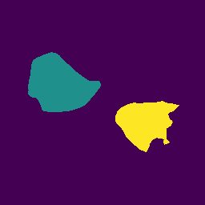
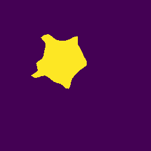
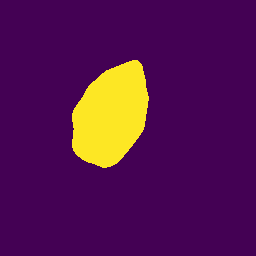

# EIT Image Reconstruction Algorithm
This is a submission for the [Kuopio Tomography Challenge](https://www.fips.fi/KTC2023.php). 

## Authors
- Amal Mohammed A Alghamdi (DTU), Denmark
- Martin Sæbye Carøe (DTU), Denmark
- Jasper Marijn Everink (DTU), Denmark
- Jakob Sauer Jørgensen (DTU), Denmark
- Kim Knudsen (DTU), Denmark
- Jakob Tore Kammeyer Nielsen (DTU), Denmark
- Aksel Kaastrup Rasmussen (DTU), Denmark
- Rasmus Kleist Hørlyck Sørensen (DTU), Denmark
- Chao Zhang (DTU), Denmark

## Addresses
DTU: Technical University of Denmark, Department of Applied Mathematics and Computer Science Richard Petersens Plads Building 324 2800 Kgs. Lyngby Denmark

## Description of the algorithm

This algorithm makes use of the level set method. It parametrizes the conductivity $q=q(\phi_1,\phi_2,q_1,q_2,q_3,q_4)$ as a piecewise constant image by
$$q = q_1(\phi_1>0, \phi_2>0) + q_2(\phi_1>0,\phi_2<0) + q_3(\phi_1<0,\phi_2>0) + q_4(\phi_1<0,\phi_2<0),$$
where $\phi_1$ and $\phi_2$ are the level set functions. We then minimize the loss function for the complete electrode forward model $\mathcal{G}$

$$F(\phi_1,\phi_2,q_1,q_2)=\frac{1}{2}\|U-U_{\mathrm{ref}}-(\mathcal{G}(q)-\mathcal{G}(0.8)) \|^2 + \beta \int_{\Omega} |\nabla q| \, dx,$$ 
by gradient descent.  Here we mean the norm $\|x\|^2 = xCx$ defined by the precision matrix $C$, which is also used in the provided reconstruction algorithm. We set $q_1 = 0.8$, $q_3=q_4=0.01$ and $q_2=5$ or $q_2=10$ depending on what gives the smaller loss.
To ensure numerical stability we reinitialize the level set functions $\phi_1$ and $\phi_2$ so that they resemble signed distance functions. We do this by finding the steady-state solution to
$$\frac{\partial d}{\partial t} + \mathrm{sign}(d)(|\nabla d|-1)=0, \quad d(x,0)=\phi_i,$$
for $i=1,2$. This is done by completing a Runge-Kutta-4 step $50$ times. 
As a starting guess for the gradient descent method, we choose two signed distance functions $\phi_1$ and $\phi_2$ that gives rise to a segmented $q$ as reconstructed by the method in [this approach](https://github.com/CUQI-DTU/KTC2023-CUQI1). If the level set method does not manage to improve the loss for the initial guess, this guess is converted to the final segmented solution.

The approach is inspired by Chung, E. T., Chan, T. F., and Tai, X.-C., “Electrical impedance tomography using level set representation and total variational regularization”, <i>Journal of Computational Physics</i>, vol. 205, no. 1, pp. 357–372, 2005. doi:10.1016/j.jcp.2004.11.022.

## Installation instructions
To run our EIT image reconstruction algorithm, you will need:

- Python 3.x
- Required Python libraries (listed in `environment.yml`)
- Access to the provided dataset (not included in this repository)

## Usage instructions

```
python main.py path/to/input/files path/to/output/files difficulty
```

## Examples
|  Phantom 	|  Ref	| Level 1 	| Level 4 	| Level 7 	|
|----------	|-----	|---	|---	|---	|
|**a**| 	| 	|   	|   	|   
|**b**| 	| 	|   	|   	|
|**c**| 	| 	|   	|   	|
|**d**| 	| 	|   	|   	|  

Scores for each phantom and difficulty 1,4 and 7:
|   Phantom	| Level 1 	| Level 4 	| Level 7 	|
|-----	|---	|---	|---	|
|**a**|0.881|0.866|0.798|
|**b**|0.738|0.695|0.567|
|**c**|0.931|0.798|0.790|
|**d**|0.904|0.815|0.732|

Scores have been computed using our own implementation of the scoring function based on scikit learn.


## License
All files in the repository come with the [Apache-v2.0](https://www.apache.org/licenses/LICENSE-2.0) license unless differently specified.
