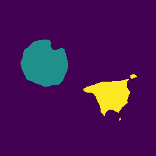
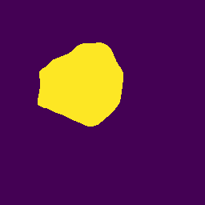

# EIT Image Reconstruction Algorithm
This is a submission for the [Kuopio Tomography Challenge](https://www.fips.fi/KTC2023.php). 

## Authors
- Amal Mohammed A Alghamdi (DTU), Denmark
- Martin Sæbye Carøe (DTU), Denmark
- Jasper Marijn Everink (DTU), Denmark
- Jakob Sauer Jørgensen (DTU), Denmark
- Kim Knudsen (DTU), Denmark
- Jakob Tore Kammeyer Nielsen (DTU), Denmark
- Aksel Kaastrup Rasmussen (DTU), Denmark
- Rasmus Kleist Hørlyck Sørensen (DTU), Denmark
- Chao Zhang (DTU), Denmark

## Addresses
DTU: Technical University of Denmark, Department of Applied Mathematics and Computer Science Richard Petersens Plads Building 324 2800 Kgs. Lyngby Denmark

## Description of the algorithm

This algorithm makes use of the level set method. It parametrizes the conductivity $q=q(\phi_1,\phi_2,q_1,q_2,q_3,q_4)$ as a piecewise constant image by
$$q = q_1(\phi_1>0, \phi_2>0) + q_2(\phi_1>0,\phi_2<0) + q_3(\phi_1<0,\phi_2>0) + q_4(\phi_1<0,\phi_2<0),$$
where $\phi_1$ and $\phi_2$ are the level set functions. We then minimize the loss function
$$F(\phi_1,\phi_2,q_1,q_2)=\frac{1}{2}\|U-U_{\mathrm{ref}}-(\mathcal{G}(q)-\mathcal{G}(0.8))\|_{C}^2 + \beta \int_{\Omega} |\nabla q| \, dx,$$ 
by gradient descent.  

## Installation instructions
To run our EIT image reconstruction algorithm, you will need:

- Python 3.x
- Required Python libraries (listed in `requirements.txt`)
- Access to the provided dataset (not included in this repository)

## Usage instructions

```
python main.py path/to/input/files path/to/output/files difficulty
```

## Examples
|  Phantom 	|  Ref	| Level 1 	| Level 4 	| Level 7 	|
|----------	|-----	|---	|---	|---	|
|**a**| 	| 	|   	|   	|   
|**b**| 	| 	|   	|   	|
|**c**| 	| 	|   	|   	|
|**d**| 	| 	|   	|   	|  

Scores for each phantom and difficulty 1,4 and 7:
**TODO: ADD SCORES FOR EACH ALGORITHM**
|   Phantom	| Level 1 	| Level 4 	| Level 7 	|
|-----	|---	|---	|---	|
|**a**||
|**b**||
|**c**||
|**d**||
Scores have been computed using our own implementation of the scoring function based on scikit learn.

## License
All files in the repository come with the [Apache-v2.0](https://www.apache.org/licenses/LICENSE-2.0) license unless differently specified.
